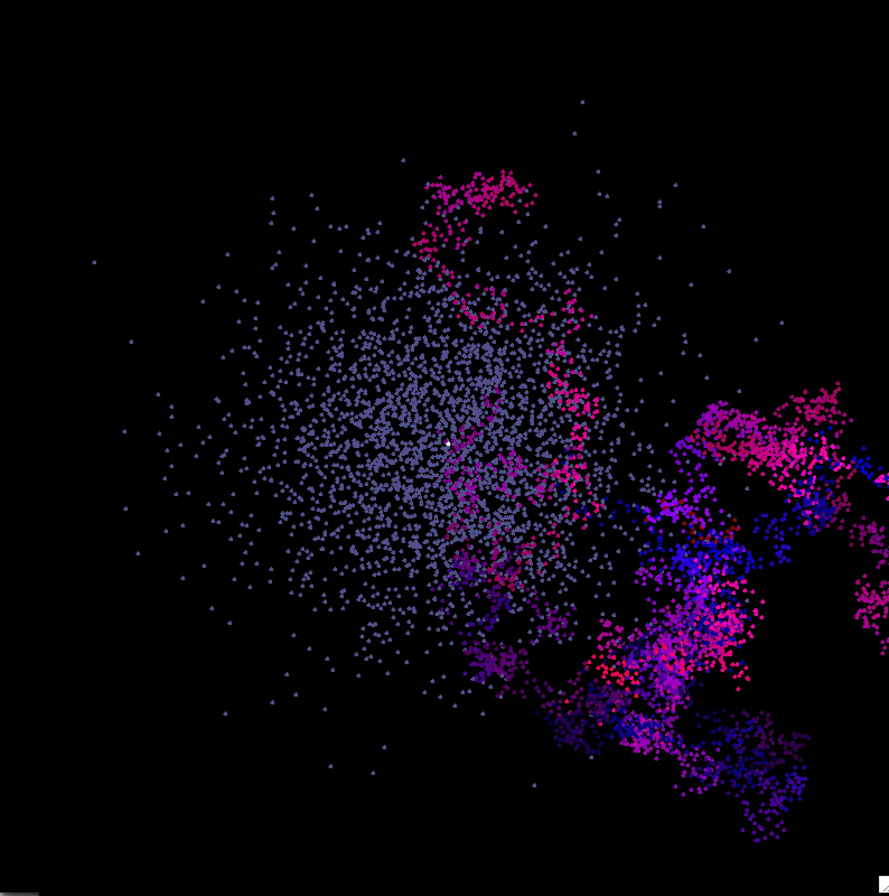

# Brownian Motion

This repo has two programs for simulating Brownian motion. They are written in OCaml. The programs display

- a Brownian path: a particle starts at the origin and makes N random moves; the particle is displayed at each step

- a Brownian cloud: M particles start at the origin and make N random steps; the final position of each is displayed

The parameters M and N can be set in the program.

Program BrownianMotion.ml displays the path and the cloud in different colors. Programm BrownianMotin2.ml does the same, except that points carry RGB color data as well as position, and the color data is subject to Brownian motion.  Thus the state space of a particle can be viewed as a the Cartesian product of a discrete Euclidean plane with a three-dimensional discrete torus, for five dimensions total. In the current version of the code for BrownianMotion2, the green component of the particle is set to zero, so the state space is effectively
four-dimensional.  This is done for esthetic reasons.

## Running the programs

-  compile: `ocamlbuild -package graphics -package unix BrownianMotion.native`
 
-  run: `./BrownianMotion.native`

Similarly for program BrownianMotion2

